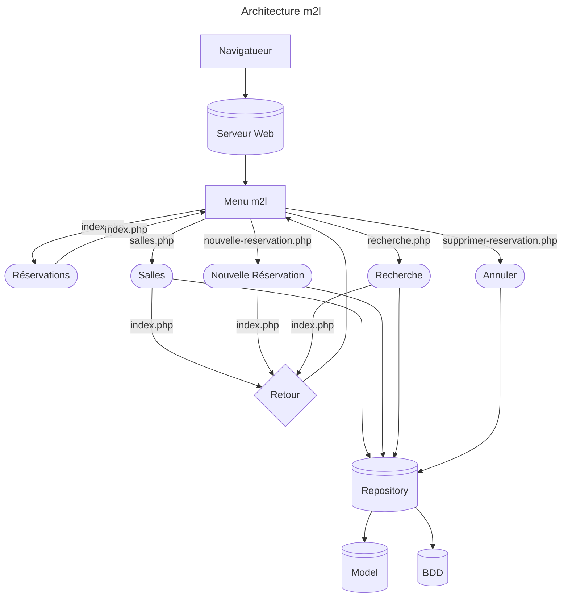

# Sprint 4



# Ticket 4 : Design -> Refactorisation de M2L avec le framework WebArt

|fonctionnalités|points d'entrée actuels|le code responsable de l'affichage|le code réalisant des traitements|le code d'accès de données|les éléments communs aux différentes pages|les dépendances entre les fichiers|
|--------------|------------------------|----------------------------------|---------------------------------|--------------------------|------------------------------------------|----------------------------------|
|Regarder le nom des salles|bouton salle|script.php|Classes.php|ClassesRepository|lien hypertexte|les Classes.php ont besoins de leurs ClassesRepository pour s'afficher|

| Élément existant | Responsabilité | Destination WebArt |
| ---------------- | -------------- | ------------------ |
|data/data.sql|Accès aux données|data/|
|data/schema.sql|Accès aux données|data/|
|public/index.php|Routage|www/|
|public/enregister-reservation.php|Affichage|page/|
|public/nouvelle-reservation.php|Affichage|page/|
|public/recherche.php|Affichage|page/|
|public/salles.php|Affichage|page/|
|public/supprimes-reservation.php|Affichage|page/|
|y'en a pas|Code HTML commun|page/template/|
|src/Model/Ligue.php|Traitement|controle/|
|src/Model/Reservation.php|Traitement|controle/|
|src/Model/Salle.php|Traitement|controle/|
|src/Repository/Database.php|Traitement|controle/|
|src/Repository/LigueRepository.php|Traitement|controle/|
|src/Repository/ReservationRepository.php|Traitement|controle/|
|src/Repository/SalleRepository.php|Traitement|controle/|
|config/database.php|Configuration|config/|

## 1. Analyse de l'existant

Avant la refactorisation, l'application souffrait de plusieurs défauts majeurs d'architecture :
1. Dispersion de la logique : Le code d'affichage (HTML) et la logique d'accès aux données (requêtes SQL) étaient mélangés dans les mêmes fichiers.
2. Absence de routeur unique : Chaque page était accessible directement via son propre fichier (ex: salles.php, supprimer-reservation.php). Cela dupliquait l'inclusion des headers/footers et rendait la maintenance complexe.
3. Problème de chemins relatifs : Les inclusions utilisaient des chemins relatifs instables (../), dépendants du dossier depuis lequel le serveur PHP était lancé.

## 2. Architecture WebArt

Voici le rôle de chaque dossier dans notre nouvelle structure :
- www/ : Le seul dossier public accessible depuis le web. Il contient le point d'entrée unique de l'application (index.php) ainsi que les éléments statiques (CSS, images).
- controle/ : Contient la logique métier et les classes d'accès aux données (les Repositories comme ReservationRepository et la classe Database). Ils exécutent les requêtes SQL et retournent des objets.
- page/ : Contient les vues spécifiques à chaque fonctionnalité (les formulaires, les listes). Elles reçoivent les données prêtes et s'occupent de la mise en page.
- template/ : Contient les fragments de code HTML réutilisables sur toutes les pages, à savoir le haut (header.php) et le bas de page (footer.php).
- data/ : Contient les scripts de structure de la base de données (fichiers .sql), ou les exports de données.
- config/ : Stocke les fichiers de configuration centralisés de l'application, notamment les identifiants de connexion à la base de données (database.php).

## 3. Refactorisation réalisée

Un des travaux clés a été la sécurisation et le nettoyage du traitement du formulaire d'enregistrement.


Avant, accès a toutes les pages en clair :

```
<?php

declare(strict_types=1);

require_once __DIR__ . '/../src/Repository/ReservationRepository.php';

$repository = new ReservationRepository();
$reservations = $repository->findAll();
?><!doctype html>
<html lang="fr">
<head><meta charset="utf-8"><title>M2L - Réservations</title></head>
<body>
<h1>Maison des Ligues — Réservation de salles</h1>
<nav>
    <a href="index.php">Réservations</a> |
    <a href="salles.php">Salles</a> |
    <a href="nouvelle-reservation.php">Nouvelle réservation</a> |
    <a href="recherche.php">Recherche</a>
</nav>
<hr>
<table border="1" cellpadding="6">
    <tr><th>Date</th><th>Créneau</th><th>Salle</th><th>Ligue</th><th>Action</th></tr>
    <?php foreach ($reservations as $reservation): ?>
        <tr>
            <td><?= $reservation->dateReservation ?></td>
            <td><?= $reservation->getCreneau() ?></td>
            <td><?= $reservation->salle->getNom() ?></td>
            <td><?= $reservation->ligue->getNom() ?></td>
            <td><a href="supprimer-reservation.php?id=<?= $reservation->id ?>">Annuler</a></td>
        </tr>
    <?php endforeach; ?>
</table>
</body>
</html>
```

Après, table de routage, on n'accède plus directement aux fichiers php pûrs:

```
<?php
$route = $_GET['route'] ?? 'reservation-salles';
switch ($route) {
    case 'reservation-salles':
        include __DIR__ . '/../page/reservation-salles.php';
        break;

    case 'salles':
        include __DIR__ . '/../page/salles.php';
        break;

    case 'nouvelle-reservation':
        include __DIR__ . '/../page/nouvelle-reservation.php';
        break;

    case 'enregistrer-reservation':
        include __DIR__ . '/../page/enregistrer-reservation.php';
        break;

    case 'recherche':
        include __DIR__ . '/../page/recherche.php';
        break;

    case 'supprimer-reservation':
        include __DIR__ . '/../page/supprimer-reservation.php';
        break;

    default:
        http_response_code(404);
        echo "<h1>Page non trouvée (404)</h1>";
        break;
}
?>
```

## 4. Parcours d'une requête

Recherche des réservations d'une ligue :
1. URL : L'utilisateur valide le formulaire, ce qui génère l'URL : /index.php?route=recherche&ligue_id=3.
2. www/index.php : Le routeur intercepte la requête, lit $_GET['route'], entre dans le case 'recherche' de son switch et inclut le fichier page/recherche.php.
3. Contrôleur : Le script récupère le paramètre (int)$_GET['ligue_id'] et appelle le composant ReservationRepository->findByLigue($ligueId).
4. Données : Le Repository interroge la base de données via Database::getConnection() et transmet la valeur filtrée à la requête préparée. Il retourne un tableau $resultats.
5. Page : Le fichier page/recherche.php réceptionne le tableau $resultats et prépare la boucle foreach pour l'affichage.
6. Template : La page inclut template/header.php au début et template/footer.php à la fin pour l'enrober du design global.
7. Réponse HTML : Le serveur PHP génère le code HTML final contenant le formulaire et la liste des réservations filtrées, puis l'envoie au navigateur de l'utilisateur.

## 5. Difficultées rencontrées

Découverte du principe de routage en php, erreurs d'inclusions (No such file or directory) très récurrentes, problèmes mentaux, compréhension de la nouvelle architecture

## 6. Test

Pour vérifier l'absence de régression tout au long de ce sprint, j'ai mis en place un protocole de tests manuels par scénario :
- Tests aux limites : Tentative d'insertion d'une réservation sur un créneau déjà pris pour valider le déclenchement de l'erreur de conflit.
- Navigation croisée : Clics répétés sur l'ensemble des liens du header.php pour valider que le routeur (index.php?route=...) ne lève aucune erreur 404.
- Persistance : Vérification directe dans la base de données (via dbeaver) après chaque ajout ou suppression pour s'assurer de la cohérence stricte des lignes SQL.

## 7. Bilan personnel 

- Gain en maintenabilité/sécurité
- La séparation des responsabilités permet la modification sans risques de l'app
- Le routeur centralise le comportement de l'application (ajouts plus simples)